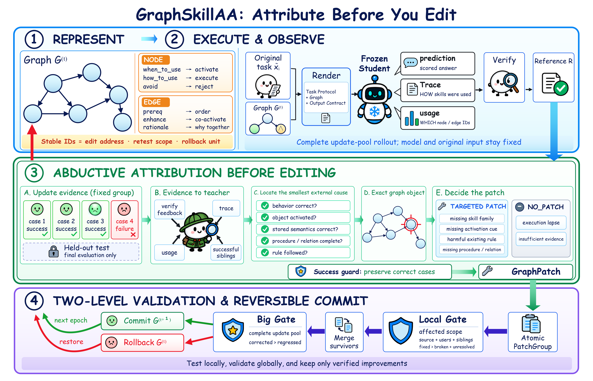

# GraphSkillAA

GraphSkillAA is a graph-structured external-skill optimization framework for frozen
language models. A shared skill graph supports semantic activation, failure
attribution, targeted editing, affected-case retesting, and rollback.

[GitHub repository](https://github.com/Ziqiao-Shang/SkillAA)



## Reported results

The released configuration uses three fixed seeds and evaluates each terminal
graph once on the held-out split. The paper reports the following mean hard
accuracies for GraphSkillAA with `gpt-5.6-sol`:

| Benchmark | Accuracy |
|---|---:|
| SearchQA | 81.5% |
| LiveMathematicianBench | 66.7% |
| DocVQA | 91.2% |

## Configuration

| Item | Fixed value |
|---|---|
| Method | Full GraphSkillAA |
| Teacher | `gpt-5.6-sol` |
| Student | `gpt-5.6-sol` |
| Benchmarks | SearchQA, LiveMathematicianBench, DocVQA |
| Optimization | 3 epochs followed by held-out evaluation |

## Protocol

For each benchmark, the update pool and held-out test set are disjoint. The
update pool is partitioned into fixed groups of four update examples. Held-out test IDs are stored separately in `test_ids.json`; they do not occur in any
update group and are not used for attribution, patch synthesis, a Local Gate,
or the Big Gate.

| Benchmark | Update | Held-out test | Metric |
|---|---:|---:|---|
| SearchQA | 800 | 200 | exact-match accuracy |
| LiveMathematicianBench | 468 | 117 | exact-match accuracy |
| DocVQA | 800 | 200 | hard accuracy (`ANLS = 1`) |

## Repository layout

```text
configs/                  experiment configuration
data/                     split metadata and prepared benchmark payloads
graphopt/                 graph representation, attribution, editing, and Gates
scripts/prepare_data.py  benchmark-data preparation
scripts/run_graphskillaa.py    experiment launcher
scripts/summarize_results.py
scripts/verify_release.py
tests/                    project tests
```

The model client, benchmark adapters, data loaders, evaluators, graph optimizer,
and Gate implementations are included in this repository. No separate skill
optimization framework is required at runtime.

## Installation

Python 3.10 or newer is required.

```bash
git clone https://github.com/Ziqiao-Shang/SkillAA.git GraphSkillAA
cd GraphSkillAA

python -m venv .venv
source .venv/bin/activate
python -m pip install --upgrade pip
python -m pip install -e .
cp .env.example .env
```

Set the OpenAI-compatible OpenLux credential in `.env`:

```dotenv
OPENLUX_API_KEY=your_key_here
```

Both roles use the fixed `gpt-5.6-sol:nitro` route with medium reasoning
effort. Do not commit `.env`.

## Data preparation

Raw benchmark files are not redistributed. The helper below downloads the pinned
official snapshots and materializes a runnable reference split:

```bash
python scripts/prepare_data.py --dataset searchqa
python scripts/prepare_data.py --dataset livemathematicianbench
python scripts/prepare_data.py --dataset docvqa
```

You may also prepare the documented file layout manually; see
[`data/README.md`](data/README.md). Before running paid requests, check that the
payloads are readable, complete, disjoint, and compatible with the update groups:

```bash
python scripts/run_graphskillaa.py --dataset searchqa --check-only
python scripts/run_graphskillaa.py --dataset livemathematicianbench --check-only
python scripts/run_graphskillaa.py --dataset docvqa --check-only
```

The ID metadata can be checked before downloading raw data:

```bash
python scripts/run_graphskillaa.py --dataset searchqa --check-manifests
python scripts/run_graphskillaa.py --dataset livemathematicianbench --check-manifests
python scripts/run_graphskillaa.py --dataset docvqa --check-manifests
```

## Running GraphSkillAA

Run one benchmark:

```bash
python scripts/run_graphskillaa.py --dataset searchqa
python scripts/run_graphskillaa.py --dataset livemathematicianbench
python scripts/run_graphskillaa.py --dataset docvqa
```

A partially completed run can be resumed without overwriting committed state:

```bash
python scripts/run_graphskillaa.py --dataset searchqa --resume
```

Inspect the locked command without making API calls:

```bash
python scripts/run_graphskillaa.py --dataset searchqa --print-command
```

The default output path is:

```text
outputs/graphskillaa/<dataset>/<run>/
```

Important artifacts include `config.json`, `trainer_state.json`, the committed
graph snapshots, Gate records, per-case rollouts, and `final_test.json`.
Held-out results are evaluation-only and never control graph commitment.

## Result summary

After the experiment suite completes:

```bash
python scripts/summarize_results.py --output-root outputs/graphskillaa
```

The script aggregates the available `final_test.json` results and prints the summary table.

## Local verification

```bash
PYTHONDONTWRITEBYTECODE=1 python -m unittest discover -s tests -v
PYTHONPYCACHEPREFIX=/tmp/graphskillaa_pyc python -m compileall -q graphopt scripts
python scripts/verify_release.py
```

These checks validate the model configuration, update-only quadruple manifests,
imports, command construction, and release hygiene. They do not execute model
requests.

## Experiment notes

- Only graph state changes; teacher and student model parameters remain frozen.
- The initial graph and all prompt templates are included under
  `graphopt/envs/<benchmark>/`.
- Local and Big Gates use the hard benchmark score on the update pool.
- Test data is read only once for final evaluation of each terminal graph; it is
  never consumed by attribution, editing, Gate decisions, or graph selection.
- API-hosted model behavior may change over time. Preserve raw responses,
  timestamps, resolved deployment strings, and graph hashes from every run.

See [`NOTICE.md`](NOTICE.md) for the benchmark-data notice.
